# WildMap 项目讲解

WildMap 是一款大地图 SLG：地图 7.2 公里见方，服务端是单进程 Go，客户端是浏览器里的 React + three.js。

本文面向新加入的成员，按以下顺序展开：界面怎么用 → 后端怎么分模块 → 地图怎么组织 → 怎么寻路和行军 → 战斗怎么算 → 各玩家子系统 → 客户端怎么渲染。


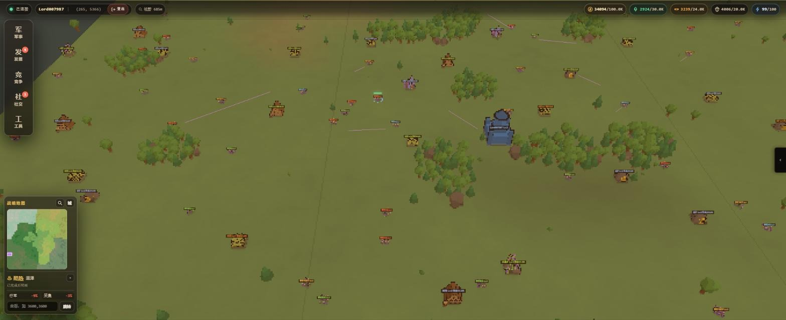

## 目录

1. [项目一览](#1-项目一览)
2. [界面操作](#2-界面操作)
3. [后端架构](#3-后端架构)
4. [地图算法](#4-地图算法)
5. [寻路算法与行军](#5-寻路算法与行军)
6. [战斗核心](#6-战斗核心)
7. [玩家侧与社交子系统](#7-玩家侧与社交子系统)
8. [客户端技术](#8-客户端技术)

---

## 1. 项目一览

| 指标 | 数值 |
|---|---|
| 进程 | 单进程，10 个 Actor 模块 |
| 地图 | 7,200,000 mm（7.2 km）见方；坐标用 int32 毫米 |
| 导航网格 | 43,799 个三角形，合并成 15,928 个凸多边形 |
| 气候 × 天气 | 7 种 × 10 种；天气每 20 分钟一个时段 |
| 战斗节奏 | 每秒 1 个回合，每回合 7 个阶段 |
| 技能 | 65 条战斗技能；技能树 133 个节点 |
| 配置 | 29 张 TSV 表，加上 4 份地图 JSON |

| 端 | 技术栈 |
|---|---|
| 服务端 | Go · xhive Actor 框架 · ChanRPC · xdoc 嵌入式文档库 · koanf · cmux · coder/websocket · gopher-lua |
| 客户端 | React 19 · TypeScript 7 · Vite 8 · three 0.184 + @react-three/fiber 9 · camera-controls · zustand 5 · Tailwind 4 · oxlint |

仓库目录：

| 目录 | 内容 |
|---|---|
| `cmd/game` | 进程入口 |
| `internal/<模块>` | db、auth、play、rank、actv、mail、chat、wmap、gm、gate 十个模块 |
| `internal/proto` | 协议：`client/` 是客户端协议，`iproto/` 是模块间消息 |
| `internal/gconf` | 配置加载与校验 |
| `internal/infra` | 公共基础设施，例如 savemgr |
| `pkg/` | 与业务无关的库：xnavi（导航）、xgeo（几何）、xtsv、xnet、xword（敏感词）等 |
| `resource/` | 地图 JSON、TSV、Lua、前端构建产物，用 go:embed 内嵌 |
| `web/` | 前端源码 |

---

## 2. 界面操作

### 2.1 主界面布局

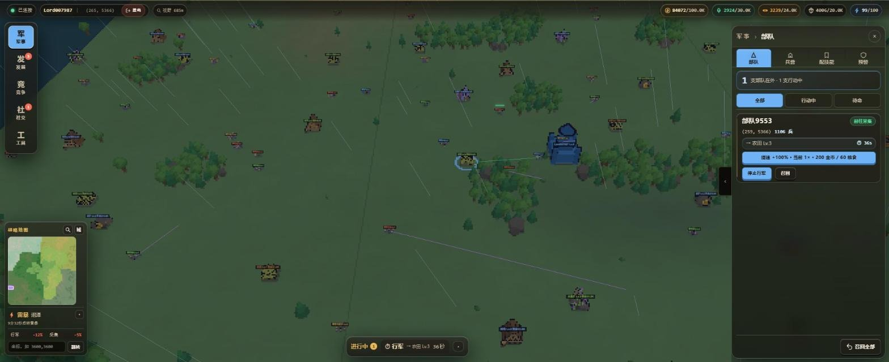

| 区域 | 组件 | 内容 |
|---|---|---|
| 顶部 HUD | `HudTopbar` | 连接状态、玩家名、主城坐标（点击回城）、登出、视野跨度；来袭预警胶囊（显示最近一路的倒计时，有攻击时持续脉冲）；未读战报/侦察角标；资源条（金、粮、木、晶、体力，显示「当前/仓容」） |
| 左侧导航 | `panelDomains` | 五个域：军事 · 发展 · 竞争 · 社交 · 工具。再点一次当前域会收起侧栏。军事角标显示来袭数，发展角标显示可领的任务和福利数，社交角标显示未读数 |
| 右侧面板 | `SidePanelShell` | 宽 `clamp(280px, 22vw, 360px)`。头部显示「领域 › 页签」、说明提示和关闭按钮。只有一个页签的领域不显示页签栏。各面板用 React `<Activity>` 保持挂载，切走时只隐藏、不卸载 |
| 左下合并卡 | `Minimap` + `WeatherDock` | 标题栏（搜索、回城）→ 小地图（地形、气候色块、资源点、城堡、部队、收藏、视口框）→ 天气区 → 坐标跳转 |
| 底部事务坞 | `QueueDock` | 常驻最多 3 条，其余收进「+N」。点行军或采集条目定位到部队，点其他条目跳到对应面板 |
| 地图本体 | `GameCanvas` | 像素风 3D 场景 |

### 2.2 鼠标与键盘

| 操作 | 效果 |
|---|---|
| 左键单击实体 | 选中 |
| 左键双击实体 | 聚焦并打开详情 |
| 右键实体 | 如果已选中己方部队，直接对该实体下令；否则打开详情 |
| 右键空地 | 打开空地菜单：派兵前往（已选部队时变为「驻扎部队」）、收藏坐标、迁城到此 |
| 左键拖拽 / 中键拖拽 | 平移 / 旋转 |
| 滚轮 | 朝光标方向缩放，镜头距离 25 米～3500 米，俯仰 6°～70° |
| 方向键 / WASD | 平移，步长 `max(4000mm, 距离×0.08)`，按住 Shift 为 ×0.18 |
| Home | 回主城 |
| 触屏 | 单指平移，双指缩放加旋转 |

镜头按距离分四档细节：detail ≤160m、tactical ≤500m、regional ≤2.4km，更远是 strategic。strategic 档不渲染部队。

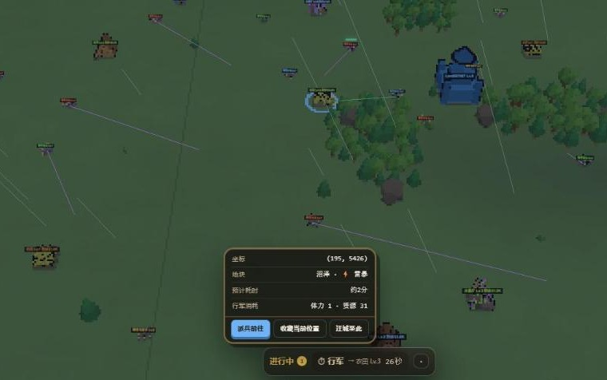 

空地菜单会显示坐标、这块地的气候与天气、预计耗时与消耗（上左图）；上右图是采集点的详情弹窗。

### 2.3 五个域的页签

| 域 | 页签 | 功能与主要按钮 |
|---|---|---|
| 军事 | 部队 | 按全部 / 行军中 / 空闲筛选；每支部队可停止行军、召回；召回全部；跳转兵营、配技能 |
| | 兵营 | 一键练满、一键治疗；每个兵种有数量框和「最大」，可训练、治疗轻伤、治疗重伤；显示在途作业已出营的人数，在途作业可取消（二次确认）；队列解锁、租用、退槽 |
| | 配技能 | 每个槽位一个下拉框，允许重复选同一技能，改动即提交；跳转技能树 |
| | 预警 | 来袭卡片：敌方、攻击还是侦察、起止坐标、到达倒计时 |
| 发展 | 主城 | 主城升级；科技研究；作业加速、取消；发展队列扩容、退槽 |
| | 技能树 | 网状画布，可拖拽、缩放；选中节点后学习或退点；回中；整树重置；「展开」打开大浮层 |
| | 福利 | 收益仓库、在线奖励、活动档位的领取；一键领取 |
| | 任务 | 日常 / 章节切换；单项领取；领取章节奖励 |
| | 签到 | 7 日网格，底部「领取今日」 |
| 竞争 | 排行 | 下拉选榜，按周期切换，显示本周期剩余时间 |
| 社交 | 邮件 | 系统 / 战报 / 个人 / 收藏四格；单封领取、收藏、删除；一键领取、全部已读、删除已读 |
| | 聊天 | 世界、群、私聊；建群、退群；点发言人名字发起私聊；举报；屏蔽 |
| | 好友 | 按 ID 查找后申请；同意 / 拒绝申请；删除好友 |
| 工具 | 指令 | GM Lua 指令台：Ctrl+Enter 执行，命令手册点击插入模板 |
| 地图（从小地图的放大镜进入） | 搜索 / 收藏 | 按类型和最低等级搜索，点结果定位；随机迁城；收藏可定位、备注、删除 |

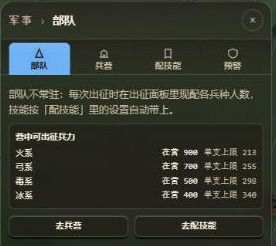  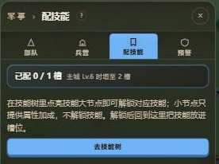

 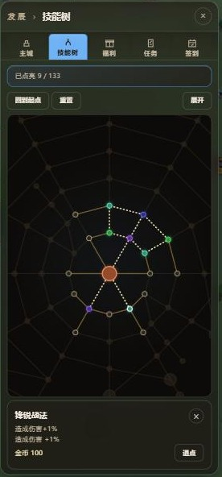 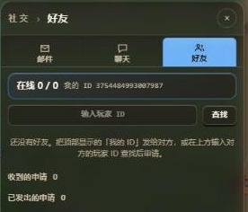

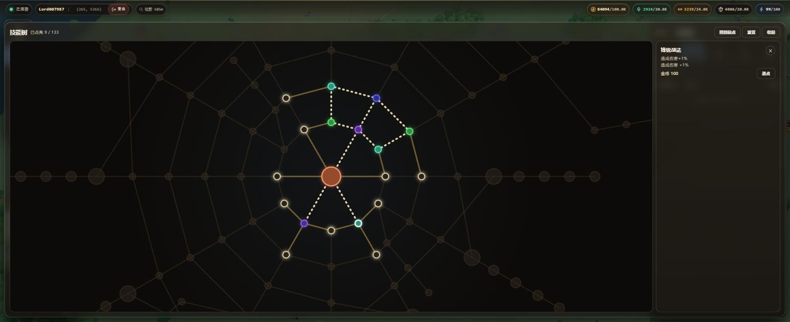

### 2.4 详情弹窗

| 对象 | 显示内容 | 可做的操作 |
|---|---|---|
| 资源点 | 采集位占用与容量、预计耗时、报价、坐标、剩余资源、采集速度 | 选一支部队派去，或新建出征 |
| 己方部队 | 兵力；兵种编成（满血 / 轻伤 / 重伤）；总攻击、总防御；负重（当前 / 上限、剩余、携带资源）；行军与采集速度；技能；气候与天气修正 | 停止行军、召回、改派 |
| 敌方部队 / 城堡 | 兵力、状态、预计耗时、行军与侦察两行报价、战力对比 | 侦察、攻击、改派 |
| 战报 / 侦察报告 | 双方战力、兵种伤亡 | 再次出征、下一条 |

己方城堡只会被选中和定位，不开弹窗。

### 2.5 出征编成


所有新建出征都要经过这个面板：
- 每个兵种一条滑条，上限是 `min(满编上限, 营中满血兵)`，默认满编；
- 可以一键满编或清零；
- 报价随编成变化重新询问，并显示与目标的兵力对比；
- 列出本次携带的技能，可以跳转到配技能页。

服务端的校验见 [5.6 行军生命周期](#56-行军完整生命周期)。

### 2.6 天气画面与 GM 指令台

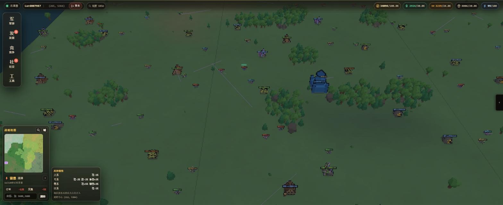

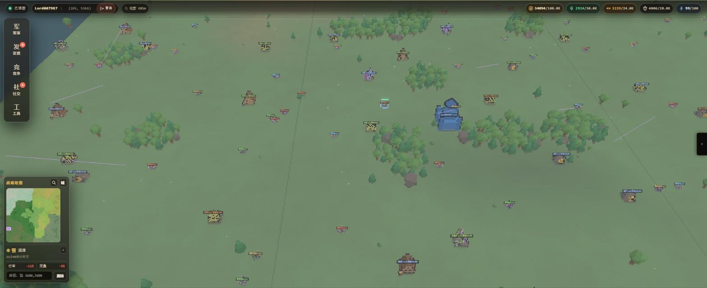

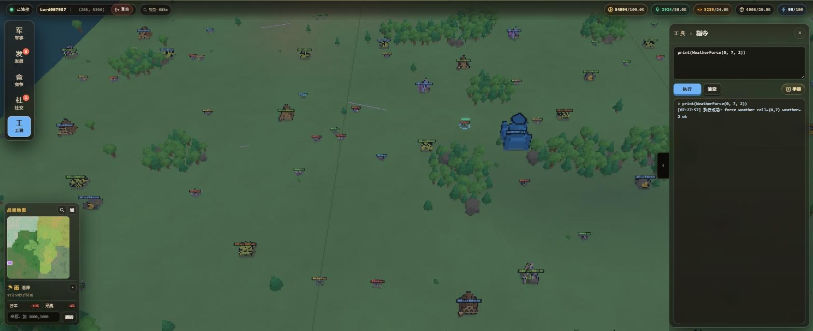

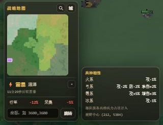

合并卡显示的都是**视野中心**所在格的数据：
- 当前天气和气候、下一时段的天气、切换倒计时；
- 行军与采集的合计修正，与服务端同样封顶；
- 点小三角，从卡片右侧弹出兵种相性（上面雷暴那张图的左下角）。

### 2.7 窄屏与无障碍

| 条件 | 适配 |
|---|---|
| 宽 ≤767px | 导航变成底部横条，侧栏变成底部抽屉（`min(56vh, 520px)`）；抽屉打开时隐藏小地图和事务坞 |
| 高 ≤680px | 导航按钮更紧凑并隐藏文字，小地图缩到 120px |
| 高 ≤500px | 隐藏小地图画布和坐标输入 |
| 触屏（`pointer: coarse`） | 放大可点击区域 |
| `prefers-reduced-motion` | CSS 把动画和过渡压到 0.01ms；JS 侧统一读 `utils/reducedMotion.ts`，关掉镜头震动、粒子、天气和闪电 |
| `forced-colors: active` | 交出颜色控制，关掉模糊和阴影 |

---

## 3. 后端架构

### 3.1 启动与停机

**入口**（`cmd/game/main.go`）：
1. cobra 解析 `-c` 参数；
2. `gconf.Load` 加载配置；
3. `xhive.Run(db, auth, play, rank, actv, mail, chat, wmap, gm, gate)`。

启动失败时，错误同时写 stderr 和 slog，因为日志可能已经配置成写文件。

**启动顺序由 `Priority()` 决定**，与参数顺序无关。xhive 按 Priority 升序稳定排序：

| 模块 | Priority | 理由 |
|---|---|---|
| db | 1 | 最先起、最后关：其他模块在 OnDestroy 里还要落最后一批数据 |
| auth、play | 2 | 晚于持久化，早于依赖玩家数据的模块 |
| rank、actv、mail | 3 | — |
| chat | 4 | — |
| wmap | 5 | — |
| gm | 6 | — |
| gate | `math.MaxUint` | 一开始接受连接，请求就会打进各业务模块，所以必须最后起 |

**启动流程**：
- 先串行调每个模块的 `OnInit`，任何一个出错就中止。
- 全部成功后，才为每个模块起 `Serve` goroutine，再等所有模块 Ready。
- 所以 **OnInit 里不能做跨模块调用**。各模块的冷启动读档都挂在 0 延迟定时器上。

**停机**：收到 SIGINT/SIGTERM 后，按启动的逆序逐个关：gate → gm → wmap → … → db。单个模块依次执行：cancel ctx → 等 Serve 退出 → `OnDestroy` → 释放出站 client。client 放到最后，是因为 OnDestroy 里还要给别的模块投消息。

**停机时怎么保证落库**：
- play、wmap、mail、chat、rank、actv 的 OnDestroy 都调一次 `saveMgr.SaveAll()`，对每个集合做**全量、同步**的 BulkSave。
    - 全量：脏标记漏标是静默故障，停机是唯一的兜底机会。
    - 同步：事件循环已经停了，异步回包不会再有人处理。
- db 的 OnDestroy 先等所有已派发的 Op 执行完（最多 30s），再在 10s 内关闭数据文件。

### 3.2 Actor 模型与 ChanRPC

每个业务模块都内嵌 `*xhive.Skeleton`，自己只实现 `OnInit` / `OnDestroy`。

**事件循环**：`Skeleton.Serve` 在**一个 goroutine** 里 select 五路事件：
- ctx 取消；
- 定时器到期；
- 本模块发出的 AsyncCall 的回包；
- 其他模块发来的请求；
- AsyncGo 的回调。

每次 select 只取一条，慢 handler 不会饿死其他几路。模块的所有状态都只在这个 goroutine 上读写，**所以不加锁**。队列默认 4096，play、wmap、gate 调到 10000。

**三种跨模块调用**：

| 调用 | 阻塞 | 对端队列满时 | 回调在哪执行 | 用途与约束 |
|---|---|---|---|---|
| `Cast` | 否 | 丢弃并告警 | 没有回调 | 通知类消息 |
| `AsyncCall` | 否 | 立即返回 `ErrChanFull` | 回到**调用方自己的事件循环**，可以安全改本模块状态 | 派发失败时回包不会来，调用方要自己补失败处理 |
| `Call` | 阻塞整个事件循环 | 等待空位 | 同步返回 | 只用于冷启动、停机、退款这类必须同步的场景，并且带超时（play 同步读写存储 3s，gate 调 auth 登录 15s）。A→B→A 成环会死锁 |

**其他两个机制**：
- 延迟回包：handler 先 `ci.Hold()`，稍后在别的 goroutine 里 `Ret`。db 靠它把存储 IO 移出事件循环。
- `AsyncGo(name, f, cb)`：f 在独立 goroutine 执行，cb 回到本模块事件循环执行。GM 跑 Lua 脚本就用它。

跨模块消息全部定义在 `internal/proto/iproto`，只传值。命名约定：`P2M*` 表示 play→wmap，`M2P*` 表示 wmap→play，`M2Mail*` 表示 wmap→mail。

### 3.3 分帧与定时器

**Self-Cast 分帧**：定时器回调只收集本轮要处理的 ID，打包成 `XxxFrame` 消息 Cast 给**自己**。handler 每帧取 N 个处理，剩下的再 Cast 给自己。两帧之间事件循环可以插进别的消息，全服遍历不会卡住模块。

| 常量 | 每帧上限 | 用途 |
|---|---|---|
| `MarchTickSplitCount` | 50 | 行军推进 |
| `NpcAiTickSplitCount` | 50 | NPC AI |
| `BattleCollectSplitCount` | 100 | 战斗收集 |
| `ZoneRefreshTickLimit` | 128 | 刷新区域 |
| `GatherTickSplitCount` | 50 | 采集 |
| `nextDaySplitCount` | 20 | play 跨天结算（单个玩家成本高，所以更小） |

**定时器**：
- xhive 用时间轮，精度 64ms。周期任务不用 Ticker，而是在回调里续期。
- 守护型定时器（存盘、跨天）**先续期再干活**，这样中途出错，下一轮照样会跑。

**1 秒补偿**：分帧本身要耗时，处理完再固定挂 1s，周期会越拉越长。所以：
- 行军起始时记 `NextTickTs = now + 1s`，最后一帧挂 `max(NextTickTs - now, 0)`；
- 战斗挂 `1000ms - 本 tick 已用时间`。

### 3.4 模块职责

| 模块 | 持有的权威状态 | 要点 |
|---|---|---|
| db | 无业务语义 | 只执行 `iproto.IOp`；同一集合的写严格保序 |
| auth | 账号（常驻内存） | Argon2id；登录限频 |
| play | 玩家档：资产、兵营、队列、科技、技能树、配技能、任务、福利、活动个人进度 | 按需加载、闲置驱逐 |
| wmap | 地图实体、行军、战斗、视野、气候天气、刷新 | 地图的唯一权威 |
| mail | 收件箱、全服组邮件 | 拉取游标模型 |
| chat | 频道、群、好友、禁言、举报 | 敏感词过滤 |
| rank | 排行榜 | 惰性翻周期 |
| actv | 活动排期（个人进度在 play） | 以开服时刻为锚 |
| gm | 不持有状态 | Lua 命令转发给对应的权威模块 |
| gate | 客户端连接 | 协议分流、会话绑定、心跳流控 |

### 3.5 两条典型链路

**链路一：玩家下令出征（三段式）**

```
客户端 newMarch
 → gate：查上行注册表解码，覆写 playerID，默认投给 play
 → play.onNewMarchReq：只收在线玩家；只读校验选兵；Queues.Occupy 用负数占位键预占行军槽
 → P2MNewMarchReq
 → wmap.onP2MNewMarchReq：以城堡为出发点解析目标、按路程报价
 → M2PNewMarchCheckReq{Quote}
 → play.onM2PNewMarchCheckReq：TakeMarchSoldiers 取兵；chargeMarch 一批扣掉体力和资源并生成 ChargeID
 → P2MNewMarchCheckSuccess{Cost, ChargeID, Soldiers, Skills}
 → wmap.onP2MNewMarchCheckSuccess：createTroop → AddUnit → 寻路 → startMarch；
     广播 UnitsNtf，attachMarchCost 记下实扣，saveMarchUnitNow 写穿部队档
 → M2PNewMarchSuccess
 → play.confirmNewMarch：槽位从占位键 Rebind 到真实 troopID，写穿玩家档，回 NewMarchAck
```

- **为什么要往返三次**：资产的权威在 play，地图的权威在 wmap，两边都是单线程 Actor，不能跨模块加锁，只能靠消息往返。
- **为什么先写部队档、后写槽位**：中途宕机最坏停在「部队在、槽位没占上」，可以自愈；反过来就会永久占死一个槽。
- **任何一段失败都回滚**：退兵、释放槽位、按 ChargeID 幂等退款。

**链路二：战斗结束 → 战报邮件 → 客户端角标**

```
wmap 战斗 tick：battleTroopDead / battleChasingFail
 → broadcastBattleReport：PackReport + TrimForStorage(16)
 → sendBattleReportMail：按攻/守 × 胜/负/平选模板 2010–2015
 → M2MailSend{Payload.Report}
 → mail.onSendMail → deliverTo：离线玩家按需加载收件箱，Add、Trim、MakeDirty
 → MailNewNtf 推给在线客户端（gate 查不到连接就丢弃）
 → 前端更新未读和红点，弹出战报
```

离线玩家下次登录时，由 `mail.onPlayerOnline` 下发各邮箱的统计。战报只走邮件，是为了让离线玩家也能收到，并且事后可查。

### 3.6 玩家档的加载、缓存与驱逐

- **`PlayerMgr`**：每个条目记录 `online`、`saving`（落库在途计数）、`lastAccessMs`，另有加载中的等待者队列。
- **`FindPlayer` 只认在线玩家**，处理客户端请求时用。**`FindCached`** 不区分在线离线，给 wmap 回调链用。
- **`withPlayer`**：
    - 玩家在内存：直接执行。
    - 正在加载：排队等待。
    - 不在内存：`AsyncCall(db, LoadOp)`，回包后装进缓存，`initPlayerRuntime` 重算属性、补体力，再依次执行所有等待者。
    - 同一玩家的多条消息合并成一次读库，否则会建出多份对象，改动互相覆盖。
    - 加载期间玩家自己上线了：丢弃读回来的档，用内存里那份。
- **下线只置 `online=false`，不移出内存**：下线瞬间可能还有 wmap 回调在路上，要给它们留个落脚点。
- **驱逐**：每轮分片落库派发之后触发，扫描全部缓存。条件是离线、没有落库在途、不脏、不在加载中，并且闲置满 `PlayerKeepAliveSec`（默认 3600s）。顺序必须是先落库再驱逐，否则落库失败时就没人持有那份数据可以重试。

### 3.7 落库：savemgr 与 db

**分片错峰**（`internal/infra/savemgr`）：
- 每个集合注册一个 `Spec{Dura, Grad, Chunk, Collect…}`。
- 定时器每 `Dura/Grad` 触发一次，片号轮转。按主键取模（先取绝对值）选出当前片。
- 各集合的首次触发逐秒错开，避免同一时刻一起写。

| 集合 | 周期 / 片数 / 单批上限 |
|---|---|
| 玩家档 | 120s / 4 片 / 256 条（每 30s 写一片） |
| 地图部队、侦察、NPC、采集点 | 10s / 4 片 / 256 条 |
| 气候种子 | 只在停机时写，且必须先读回 |

**脏标记集合（例如玩家档）**：
- 取快照、清脏标记、标记「落库在途」都在**派发之前**完成。要是等回包再清脏，派发之后的新改动会被一起清掉。
- 写失败时重新标脏，下一轮重写。

**快照必须深拷贝**：快照在 db 的 goroutine 上编码，而 play 同时还在改玩家状态，共享任何 map、切片或指针都是数据竞争。

**Mirror 比对**（没有脏标记的集合，如 NPC、采集点）：
- 记住每条记录上次写出的内容，用 `reflect.DeepEqual` 比较，没变就跳过；停机时照写。
- 写失败的记录改记为「未写」，下一轮必定重写。

**删除与读回保护**：
- 删除固定排在写入之后派发；同一时间只有一批删除在途，失败整批重试。
- 声明 `AwaitLoad` 的集合在读回之前跳过所有落库，免得把「还没读回来」当成空状态写回去。

**db 与 xdoc**：
- `Database.URI` 目前只支持 `xdoc://`；打开时校验 schemaVersion，不认识就拒绝启动。
- 所有 Op 先 Hold，再移到事件循环之外执行，最多 32 个并发，单个超时 10s。
- 读 Op 并发执行；**写 Op 按集合排队，严格按到达顺序串行**。写和删可以分开投递，不会出现记录「复活」或新快照被旧快照覆盖。

### 3.8 网关

- **分流**：
    - 监听器装饰链是 raw → ACL → PROXY protocol。
    - `cmux` 按内容嗅探分流：HTTP/1 走 `http.Server`，其中 `/ws` 升级为 WebSocket，其余路径是 gzip 静态资源；其他流量走原生帧（4 字节小端长度 + JSON 正文，单帧上限 50MB）。
    - 支持的监听地址是 `tcp://host:port` 与 `unix://路径`（Windows 上是 npipe），配置解析只放行这两类。
- **编解码**：统一信封是 `{Kind, Data}`。
    - 上行 kind 在 `proto/client/registry.go` 登记，并指定目标模块，未指定的默认投给 play。
    - 没登记的 kind 直接拒绝。登录前只允许匿名消息，登录后反过来不允许。
    - 解码后**无条件用服务端认定的 playerID 覆盖**客户端自报的值。
- **会话绑定**：
    1. 调 auth 校验凭据（15s 超时）；
    2. 用 `sync.Map.Swap` 登记新会话，旧连接先推 `SessionReplacedNtf` 再关闭；
    3. 回 AuthAck，通知 play 玩家上线。
    - 断线时用 `CompareAndDelete` 删会话，只有真删到了才通知 play 下线，防止快速重连时旧连接的下线通知误伤新会话。
- **心跳与流控**：

| 参数 | 值 | 行为 |
|---|---|---|
| 心跳检查 / 断开 | 120s / 300s | 任何上行都算心跳，300s 无消息断开 |
| 最小包间隔 | 50ms | 太快就 sleep 补足，只限速不断开 |
| 窗口上限 | 10s 内 1 万包 | 超过就断开 |
| 发送队列 / 写超时 | 256 / 10s | 每个连接独立发送队列；满了就踢，免得一个慢客户端拖住全服广播 |

客户端发 `ping`，服务端回 `PongAck{ServerTime}`，供客户端校正时钟。

### 3.9 配置

- **叠加顺序**（后面的覆盖前面的）：代码默认值 → YAML → 环境变量（前缀 `GAME_`，下划线表示层级）→ 命令行。
- **资源**：`resource/` 用 go:embed 内嵌。配置了磁盘目录时，逐个文件「磁盘优先，缺失回落到内嵌」，所以只需放要覆盖的文件。
- **TSV 格式**（`pkg/xtsv`）：
    - 第 1 行是字段名，也是唯一参与解析的行；第 2 行是 Go 字段名；第 3 行是中文说明；之后是数据，复杂字段内嵌 JSON。
    - 行级校验用 `IValidator`，跨表外键用 `CheckRefs`。
- **加载顺序**：`gconf.tsvTables` 的顺序就是依赖顺序，被引用的表先加载。整张表放在 `atomic.Pointer` 里，替换是原子的。
- **热重载**（GM `ReloadConf()`）：
    - 每张表两阶段提交：先把新数据读进暂存区，跑完 PostLoad（校验、建索引）和派生数据的计算；全部成功才一次性发布，任一步失败整张表保持旧版本。
    - 按依赖顺序逐表进行，敏感词库一并重载；同一时刻只允许一次重载。结果报告替换了几张、失败了几张及原因。
    - 重载之后：play 分帧给常驻玩家重算属性并推送；wmap 重推天气预报、重算在采部队的气候加成，地块气候变了时清掉 GM 强制天气。
    - 全局最大占地半径只增不减：它决定视野取格外扩多少，缩小会让正在地图上的大单位漏出视野。
    - 地图上已有的实体和在途行军仍按原配置运行。

### 3.10 日志

- 全仓直接用 `log/slog` 的包级函数，字段一律用强类型构造（`slog.Int64("player_id", …)`），message 用字面量。Handler 由 xslog 提供，支持 console 和 json 两种格式，以及文件轮转。
- 面向玩家的失败只推**错误码**，原始 error 只写日志。

---

## 4. 地图算法

### 4.1 坐标系与地图数据

- 平面轴是 X/Z，单位毫米，用 int32 存；叉积这类运算用 int64，避免浮点误差。
- 四份地图文件：

| 文件 | 内容 | 用途 |
|---|---|---|
| Map.json | 地图尺寸与各网格边长 | 所有网格换算的依据 |
| Tile.json | `tiles[1600]` 存障碍模板下标（-1 为空地），`obstacles[1024]` 是障碍三角网，坐标相对地块左下角 | 地块级放置障碍。1600 个地块共用 1024 份模板，相同地形只存一份 |
| Obstacle.json | 一张全图三角网（5,982 个三角形），世界坐标 | 跨地块的放置障碍 |
| Navi.json | NavMesh：33,230 个顶点、43,799 个三角形 | 寻路 |

- **能不能放下**（`CanPlace`）：
    1. 圆不能超出地图矩形；
    2. 在九宫格地块里，只对与圆相交的地块检查：把圆心换算成地块局部坐标，查该地块模板里有没有三角形与圆相交；
    3. 需要时再查全局障碍（绕行场景会跳过这一步）。

  `CanPlaceUnit` 在此基础上，再用占地半径和九宫格内的其他单位做碰撞检测。
- 障碍分两套数据：NavMesh 管寻路，地块和全图障碍管放置。两者互不校验。

### 4.2 网格

同一张地图，按用途切成几套粒度不同的网格：

| 网格 | 边长 | 规模 | 数据结构 | 用途 |
|---|---|---|---|---|
| 碰撞栅格 | 15m | 480×480 | `[][]*Grid`，每格一个 `map[id]IUnit` | 单位增删查、碰撞、区域查询 |
| 视野格 | 15m×30m | 480×240 | `[][]*ObView`，含观察者集合和经过的行军单位 | AOI 订阅、行军路径反查 |
| 地块 | 180m | 40×40 | `[][]*Tile`，每格挂一个障碍搜索网格 | 放置判定、气候、行军切段 |
| 刷新区域 | 60m | 120×120 | ZoneConf 表加索引 | 刷新配额 |
| 天气格 | 720m（4×4 地块） | 10×10 | 不存数组，现算 | 天气时段抽取 |

单位有多重索引：
- `mapUnits[kind][id] = 格号`（格号编码为 `gx*10000+gz`）；
- `unitKinds[id]` 反查类型；
- `marchUnits[kind]` 记录行军中的单位。

按 ID 取单位全程 O(1)。区域查询先按矩形取覆盖到的格子粗筛，再按坐标精筛。

### 4.3 地图实体

类型值会写进存档和协议，只能在末尾追加。

| Kind | 类型 | 占地/阻挡半径 | 生命周期 | 落库 |
|---|---|---|---|---|
| 1 | 玩家城堡 | 6m / 4m | 玩家首次进入时随机选址建城；常驻；可迁城 | 写穿，集合 `castle` |
| 2 | 玩家部队 | 2m / 2m | 出征创建 → 行军、驻扎、采集、战斗 → 回城结算后销毁 | 脏标记 + 周期落地（10s / 4 片），集合 `troop` |
| 3 | （保留） | — | 原 NPC 城堡，类型已删除；编号不复用 | — |
| 4 | NPC 部队 | 按配置 | 刷新生成 → 游荡或主动攻击 → 被击杀或到期删除（存活时长按毫秒配置，当前 5 小时） | 只落「碰过的」，Mirror 比对 |
| 5 | 采集点 | 按配置（4m / 2.5m） | 刷新生成 → 采空，或过期且无人在采时删除 | 只落「碰过的」 |
| 6 | 城防守兵 | — | 城堡被攻击时临时创建，战后删除 | 不落库 |
| 7 | 侦察部队 | 2m，不阻挡任何单位 | 派出后往返一趟，回城即销毁 | 与部队同节奏，集合 `scout` |

- **「碰过」的判定**：被行军锁定、正在战斗、有兵损、带战利品、有部队在采、剩余量已偏离初始值。没碰过的实体重启后直接由刷新补上，不必存。
- **销毁时删档**：实体销毁时要同步登记删除，否则崩溃重启后已被拿走收益的实体会复活。
- **冷启动顺序**：城堡 → NPC 与采集点 → 部队，串成一条定时器链。城堡和部队读档失败时每 5s 重试，就绪前链条不往下走；单条损坏的部队快照跳过并保留存档；NPC 与采集点读档失败则由下一轮刷新补满。

### 4.4 视野（AOI）

**注册视窗**（`onMapViewReq`）：
- 视窗 = 中心点 ± span/2，span 钳到 ≤1000m，再与地图求交。
- 同一观察者两次请求至少间隔 200ms，太快的直接丢弃。

**反向索引**：每个视野格记录两样东西：
- 视窗覆盖到本格的玩家；
- 路径经过本格的行军单位。

另外 `march[unitID]` 保存每条行军覆盖的全部视野格，删除时用它反查。

**视窗移动时的差分**：
- 格集差分（`getDiffObViews`）：旧格集合做 set，遍历新格集合得到「新增」和「重叠」，删除 = 旧格 − 重叠。只对变化的格子增删订阅。
- 实体差分（`DiffRectUnits`）：
    - 当前可见集 = 覆盖格内的实体 + 将要穿过视窗的行军 + 玩家自己的全部部队。静止单位按占地圆与视窗相交判定，行军单位按中心点判定；
    - `old` 是**客户端已知单位**：视野响应整表重置，两次请求之间的 `UnitsNtf` / `DelUnitsNtf` 推送也逐条记账；
    - `new = cur − old`，`del = old 中已不可见的`；
    - 还在被自己部队采集的采集点不删；
    - 待删超过 400 条就整体清空；
    - 同一 ID 的删除通知最多重推 8 次。

**行军路径栅格化**（`xgeo.SegmentGridCells`）：
- 先加入两端点所在的格子；
- 再求线段与每条横、竖分割线的交点，把交点两侧的格子加入集合。
- 对每个 MoveSection 做一遍，汇总去重后登记到视野格。
- 查询时再用 `willPass` 二次裁剪：只看剩余路段（当前段起点换成实时坐标）是否与视窗相交。

**什么时候推送**：
- 行军每秒推进坐标，但**不广播**。只有路径变化（绕行、改道、速度变化）才发 `PositionNtf`，客户端按时间轴自己插值。
- 状态变化时，通知对象 = 行军覆盖的全部路径格（静止单位取占地圆覆盖的格）上的观察者 + 归属者，再按可见规则过滤。
- 位置推送时，还不认识该单位的观察者改收完整的 `UnitsNtf`：客户端只更新表里已有单位的位置，一个从视窗外改道穿进来的单位只收到 `PositionNtf` 是不会出现的。
- 路径变短时，给不再经过的格子上的观察者发删除。

**可见规则与清理**：
- 可见规则由 `ZoomViewConf` 决定；侦察部队只有自己可见。
- 玩家离线超过 20 分钟，由每 10 分钟一次的巡检删除其观察者。

**客户端上报**：
- 前台每秒一次，后台每 3 秒一次；镜头变动时触发，节流 250ms；内容没变就不发。
- 两轴 span 都 ≥1500m 时切到缩略视图，不再请求实体。

**客户端合并**：只有进场（本地实体表刚清空）时带 `reconnect: true` 要全量，之后都是增量。响应里的 `units` 按 ID 合并进实体表，`need_delete_units` 才删除；同一帧到达的多条响应先累积再一次性合入。

### 4.5 实体刷新

**周期**：启动 1s 后跑第一轮。之后每轮全部处理完，再挂 15 分钟定时器，自调度。

**zone 与 band**：
- zone：60m 见方，共 14,400 个。每个有 5×5 = 25 个预设刷新点（间距 12m），可用面积约 3.6×10⁹ mm²。
- band：玩法分组，定义在 `RefreshBandConf`。4001–4007 刷 NPC，5001–5007 刷采集点。
- zone 按到地图中心的距离分成 7 个同心环，等级从外往内递增。例如 4001 是 0–1 级，4007 是 10–13 级。

**目标存量**：

```
maxCnt = round(count × zone 可用面积 / 9.2×10⁹)
```

按当前配置，每个 zone 每个 band 维持约 1 个。现存量按「zone 内 confID 属于本 band 的实体数」计算，所以多个 band 共用一个 zone 时各算各的配额。

**抽取**：按权重抽配置（`utility.RandomWeight`），等级 = `rand[MinLevel, MaxLevel] + 基础等级`。

**分帧**：band 逐个处理，每帧最多 128 个 zone，剩下的 Self-Cast 到下一帧。

**选址**：
- 对 zone 的刷新点只做一次 `rand.Perm`，本 zone 所有待刷项共用一个游标。
- 每个候选点做放置判定（地形障碍 + 与其他单位的占地碰撞）；游标用尽就停。

**落地**：
- 刷出来的实体加进地图后立即广播给视野内的玩家，不用等镜头移动。
- 「碰过」的实体 10s 周期增量落库。重启后先恢复这些实体，刷新再按现存量补差额，不会重复刷。

### 4.6 气候与天气

**气候**：`ClimateConf` 定义 7 种，`ClimateTileConf` 给 1600 个地块逐块指定。

| 气候 | 行军 | 采集 |
|---|---|---|
| 温和 temperate | 0 | 0 |
| 草原 grassland | +3% | +3% |
| 森林 forest | −4% | +4% |
| 沙漠 desert | −5% | −3% |
| 沼泽 swamp | −7% | −2% |
| 山地 mountain | −8% | −2% |
| 雪原 snow | −6% | −3% |

**天气**：`WeatherConf` 共 10 种：晴、雨、雪、沙暴、雾、酷热、大风、雷暴、冰雹、阴天。每种气候对各天气有自己的权重，例如雪原多雪、沙漠多沙暴。

**时段与天气格**：
- 时段长 20 分钟，按 Unix 毫秒全局对齐：`epoch = now / 1,200,000`。
- 天气格为 4×4 地块。格的气候取它锚点地块 `(cx·4, cz·4)` 的气候。

**确定性抽取**（`mclim/weather.go`）：

```
h = splitMix64(seed)
h = mixIn(h, cellX); h = mixIn(h, cellZ); h = mixIn(h, epoch)
     // mixIn(h, v) = splitMix64(h ^ splitMix64(v))
ids = 该格气候下权重 > 0 的天气 ID，升序
r   = h % Σ权重；按累积区间取第一个满足 r < acc 的天气
```

- ID 升序排列，是为了避免 map 遍历顺序不同导致结果漂移。
- 结果完全由（种子, 格子, 时段）决定：服务端不存逐格状态，任意未来时段都能直接算出（客户端显示的「下一时段」就是这么来的），重启后结果也不变。

**种子**：
- 首次启动用 `crypto/rand` 取 8 字节。以 int64 按位存入集合 `climate_seed`（写穿），此后永不改变。
- 读回失败每 5s 重试。就绪之前天气一律按「晴」算，新行军会被拒绝。
- 种子不进日志，因为泄露后可以推算出全部天气排期。

**时段切换**（`timerClimateEpoch`）：
1. 对 100 个天气格比较新旧时段，找出变化的格子；
2. 向全部观察者广播 `WeatherNtf`（每格含当前和下一时段）；
3. 对变化格里的采集点，每帧 50 个，按「先按旧速率结算 → 换速率 → 重建上下文」重算；
4. 按下一个时段边界重新挂定时器，避免漂移。

玩家登录时单独推一次天气。

**GM 强制天气**：只写内存覆盖表，不落库。执行后立即广播，并重算该格采集点；已经在路上的行军不重排。

**修正的合成与封顶**：气候 bp + 天气 bp，再夹到 ±上限。加载时会校验最坏组合不超过上限。

| 作用对象 | 上限 |
|---|---|
| 行军速度 | ±20% |
| 采集速度 | ±10% |
| 战斗 攻 / 防 | ±8% |
| 战斗 增伤 / 受伤 | ±6% |

### 4.7 采集

- **采集位**：容量按等级 3/6/9/12/15。出发、途中、到达三次检查容量和剩余负重。
- **懒结算**：`GatherCtx` 记录上次结算时刻、满载时刻、采空时刻。
    - 可结算时长 = `min(now, 采空时刻, 满载时刻) − 上次结算时刻`。
    - 每秒的 tick 只判断是否到时，真正结算只发生在加入、退出、速率变化、查询时。
- **速度**：
    - 单支部队产出 = `Yield × ms × (1 + 兵力档 + 属性档 + 气候档)`；
    - 采集点的合计速率 = Σ 各部队 `Yield × (1 + 加成)`，采空时刻 = 剩余量 / 合计速率，与逐部队结算同一口径；无人在采时不会耗尽，详情展示基础速度；
    - 兵力档为每 1000 人 +10%，最多 +100%；
    - 合成加速上限 +1000%。
- **负重**：
    - 上限在出征时按编成算定；
    - 负重 = Σ 资源量 / 负重系数；
    - 超载时把本次产出按比例缩到正好装满；
    - 满载时刻 = `ceil(剩余负重 / 单位时间负重增量)`。
- **速率变化的顺序**：先对全点所有部队结算，再换速率，最后重建全点所有部队的上下文并广播。
- **耗尽**：剩余低于 1e-6 视为 0。采空后其余部队全部召回，采集点删除。过期且无人在采的采集点也会删除。

### 4.8 地图搜索

- 按类型扫描全部同类单位；`Level` 作为**等级下限**过滤。
- 以主城为中心，按距离平方插入一张最多 15 条的有序表，只保留全局最近的 15 个，不为全部命中分配内存。
- 没有主城时，退化为按遍历顺序取前 15 条。

### 4.9 迁城与出生点

- **分工**：play 扣费，wmap 校验并移动。任一步失败都先退款再回执。
- **校验**：城堡存在；没有在战斗；定点迁城要通过放置判定（排除自身）；随机迁城最多试 10 个 zone。
- **随机选址**：
    - 把 zone 按 20m 切成宫格，在每格中心 10m 见方内随机取点，先随机试 10 次，失败后枚举全部宫格；
    - 城堡刻意不占 NPC 刷新点，否则会挤掉野怪配额。
- **执行顺序**：
    1. 向旧位置的观察者发删除；
    2. 改坐标；
    3. 广播新位置；
    4. 写穿存档；
    5. 只重新规划「返回本城」的行军，来袭的敌军不受影响。
- **部队出生点**：在城堡周围 8 个方向、步长 10m 处依次尝试放置。

---

## 5. 寻路算法与行军

### 5.1 导航网格

**初始化**（`xnavi.Mesh.Init`）：
- 边用 `lo<<32|hi` 编码成无向键。
- 一条边第二次出现时，判定为**邻接边**，并算出两端的内缩点：沿边向内缩 1m，让路径不贴着墙角走。
- 被三个以上三角形共享的边直接报错。
- 0 号、1 号槽保留给起点、终点的虚拟边。

**合并成凸多边形**（`MergeTrianglesToConvexes`）：
- 从每个未合并的三角形出发做贪心 BFS。
- 邻居要同时满足三个条件才能并入：未被合并、合并后顶点数 ≤100、仍然是凸的。
- 结果：43,799 个三角形合并成 15,928 个凸多边形，平均 4.75 个顶点（数据出自 `docs/nav/`）。

**点定位**：
- 用四叉树（单节点超过 1000 个对象就分裂，最多 16 层；跨象限的对象同时挂到多个子节点）找到点所在的凸多边形，再换算回三角形编号，因为搜索图是按三角形边建的。
- 凸多边形按编号排序后插入，保证落在共享边上的点每次都命中同一个多边形。

**不可达**：起点或终点不在网格内时，`Route` 返回空，上层报 `ErrNoMarchPath`。生产代码没有「吸附到最近可达点」这一步。唯一的起点修正是从城堡出发时，把起点移到城堡碰撞圆外、朝向终点的那一侧。

### 5.2 图搜索：边节点图 + 可见性 A*

生产配置是 `EdgeNodeConvexLookup`：节点是**邻接边**，定位走凸多边形索引。

| 可选的图 | 节点 | 边权 |
|---|---|---|
| TriangleNode | 三角形 | 相邻重心距离 |
| EdgeNode | 邻接边 | 同一三角形内两条邻接边的中点距离 |
| **EdgeNodeConvexLookup（生产）** | 邻接边 | 同上，定位用凸多边形 |
| ConvexEdgeNode | 邻接边，按凸多边形展开 | 中点距离 |
| ConvexNode | 凸多边形 | 质心距离（建图 O(C²)，很慢） |

- **图规模**：约 49,084 个节点、130,804 条有向弧，最大出度 4（数据出自 `docs/nav/`）。
- **起终点接入**：把起点、终点做成退化边放进 0、1 号槽，把它们所在三角形的邻接边都连过去；搜完再把图复原。整个过程是「临时改图、搜完复原」。
- **A\***：
    - g 存在 uint32 数组里；h 为两条边权重点之间的欧氏距离；
    - 开放表是带对象复用池的最小堆，同一节点可以多次入堆，弹出时跳过已访问的（懒惰删除）；
    - 只重置本次碰过的节点，重置开销 O(访问数)。
- **可见性优化（VisibleAStar）**：扩展邻边 v 时，求「当前权重点 → 终点」这条视线与 v 所在线段的交点，把交点作为 v 的权重点，再重算代价；没有交点时取离终点更近的端点。
    - 效果：搜索代价更接近拉直后的真实路径长度，而不是固定走「边中点」的折线。
    - 权重点直接写回网格数据，所以导航管理器不是线程安全的。好在它只在 wmap 的单线程里用。
- **性能**：单次寻路平均约 373µs、21 个路径点（出自 `docs/nav/`，本次没有实测）。

### 5.3 漏斗算法（String Pulling）

```
ways = [起点]; cur = 起点; e0 = 0
循环:
  L, R = 空
  从第 e0 条约束边往后逐条看:
    l, r = cur 指向这条边两端内缩点的向量（按叉积分左右）
    L 为空 → L, R = l, r；继续
    新边整体在左界左侧（L×l>0 且 L×r>0）→ 拐点 = L 的端点
    新边整体在右界右侧（R×l<0 且 R×r<0）→ 拐点 = R 的端点
    否则收窄漏斗：L←l 或 R←r
  找到拐点 → 加入 ways，cur = 拐点，从拐点所在边的下一条重新扫
  找不到   → 加入终点，结束
```

拐点取的是**内缩后**的顶点，所以路径和墙角之间始终留有 1m 余量。

### 5.4 动态绕行

- **谁会挡路**：静态建筑（城堡）和资源点。部队之间互不绕行，侦察部队不挡任何单位。
- **何时检查**：`MarchKindConf.Detour` 打开时，每帧对「当前位置」和「1 秒后的位置」各做一次碰撞检测。
- **检测分支**（`CheckCollision`）：
    1. 撞到的是追击目标，或处于飞行模式：忽略。
    2. 往后找第一个在障碍圆外的段终点；找不到说明后面全被挡住，先退款再停下。
    3. 自己已经在圆内：沿「圆心 → 自己」方向推到半径外 0.1m。
    4. 把行进线段向两侧各平移一个自身半径，两条线都不与障碍圆相交，说明只是擦边，不用绕。
    5. 否则沿切线弧绕行；绕行失败就进入 3 秒飞行模式兜底，期间无视碰撞。
- **绕行半径**：

  ```
  r = (自身半径 + 障碍半径 + 0.1m) / cos(π/8)
  ```

  弧线是用折线近似的，弦的中点离圆心只有 `r·cos(θ/2)`，除以这个系数，才能保证折线上每一点离圆心都不小于碰撞半径。π/8 对应把整圆 8 等分（每步 45°）的最坏情况。实际采样约每弧度 10 个点（间隔约 0.1 rad），所以余量很足。
- **弧线范围**：只绕到能看见终点的切线方向为止：旋转角 = ∠(圆心→切入点, 圆心→终点) − arccos(r / |终点−圆心|)，方向按叉积符号定。
- **接回原路径**：从弧尾重新寻路到终点，拼成 `[已走段, 弧线点…, 新路径…]`，再从行军开始时刻起重新生成整条时间轴。

### 5.5 从路径到时间轴

**MoveSection**（`mtype/path.go`）：

| 字段 | 含义 |
|---|---|
| Kind | 直线段 / 绕行弧线段 |
| StartCoord / EndCoord | 段起点、终点（mm） |
| StartTime / EndTime | 绝对毫秒时间戳 |
| Speed | 本段实际速度（mm/ms），已含气候和天气修正 |

**切段**（`splitLegBySpeed`）：每对相邻路径点之间循环切，每一步：

```
speed = baseSpeed × (1 + 修正bp(当前坐标, 当前时刻) / 10000)
step  = min(剩余长度,
            沿腿方向到下一条 X 地块线的距离,
            沿腿方向到下一条 Z 地块线的距离,
            speed × (本天气时段结束时刻 − 当前时刻))
EndTime = 当前时刻 + step / speed
```

每一小段只落在一个地块、一个天气时段里，所以速度在段内是常数。

**速度的组成**：
- 基础速度：部队 1 m/s，侦察 15 m/s。
- 加速：每次 +1 倍，最多 11 倍。
- 气候与天气修正：合计封顶 ±20%。
- 负重不影响速度。

**位置插值**：找到 `t ≤ EndTime` 的第一段，做 `Lerp(Start, End, (t−StartTime)/(EndTime−StartTime))`。零时长段直接返回终点，超出所有段也返回终点。弧线段同样是线性插值，靠密集采样的折线逼近圆弧。推挤等瞬移段时长为 0，速度也记为 0，客户端不会给它算出时长。

**何时重建时间轴**：
- 基础速度（`BakedBaseSpeed`）变了：保留已走的段，把当前段截断在当前位置，剩余部分重新切。
- 加速：从当前时刻起整条重建。

服务端和客户端按同一条时间轴插值，所以行军只需要同步一次，不用每帧推位置。

### 5.6 行军完整生命周期

| 阶段 | 消息 | 关键处理 |
|---|---|---|
| 询价（只读） | `marchQuote` → `P2MMarchQuoteReq` → `M2PMarchQuoteAck` | 与真实出发共用同一套判断和折算（`MarchQuote.Charge`），预估价和实扣不会对不上 |
| ① 发起 | `newMarch` → `P2MNewMarchReq` | `CheckMarchPicks`：兵种合法且不重复；人数 >0、不超过满编上限、不超过营中满血兵；任一项非法整单拒绝。预占行军槽 |
| ② 扣费 | `M2PNewMarchCheckReq` | wmap 检查气候就绪、城堡存在、目标、报价；play 取兵、扣费、生成 ChargeID |
| ③ 建兵上路 | `P2MNewMarchCheckSuccess` → `M2PNewMarchSuccess` | 建部队 → 寻路 → 开始行军 → 写穿 → 槽位换绑 |
| 改道 | `MoveMarchReq` … | 先按已走比例退掉旧行军的费用，再按新目标收费 |
| 驻扎 | `StopMarchReq` | 退款，停下，状态记为「驻扎」 |
| 召回 | `RecallMarchReq` | 采集中先退出采集，行军中先退款，然后以「回城」动作行军 |
| 加速 | `MarchBoostReq` … | 用 `ExpectedEndsMs` 防止过期请求重复生效；失败回滚退款 |

**行军中每帧做什么**（每秒一轮，每帧 50 个单位）：
1. 检查目标是否还在、坐标是否变了；
2. 挂起中的单位跳过；
3. 碰撞与绕行；更新坐标；累计已走距离；追击目标时按距离分档节流重寻路；速度变化时重建时间轴；
4. 判断是否到达：攻击看距离 ≤ 战斗半径，其他动作看距离 ≤ 1m + 自身半径；
5. 到达后按「来源类型 + 动作 + 双方关系 + 目标类型」四元组查处理函数。

| 动作 | 到达后 |
|---|---|
| 移动（去空地） | 原地驻扎 |
| 采集 | 加入采集点 |
| 攻击部队 | 开战（被攻击的 NPC 会暂停自己的行军） |
| 攻击城堡 | 异步向 play 取城防数据后开战 |
| 侦察 | 生成侦察报告，然后自动回城 |
| 回城 | 玩家部队：结算携带资源，兵力回营；侦察部队：直接销毁 |

**回城入营**：
1. 部队切到「结算中」，先存档；
2. 异步把携带资源交给 play 入账（按部队 ID 幂等）；
3. 销毁部队时发 `M2PTroopDestroyed{Soldiers}`，play 把三档兵力分别收回兵营，并释放槽位。

**退款**：
- 按已走比例退：`退还 = floor(实扣 × (1 − 已走 / 总程))`。
- 用同步 Call 送到 play（超时 5s），play 按 ChargeID 幂等，落库成功才回成功。

**计价**：
- 距离取出发点到目标的直线公里数；回城免费。
- 体力 = `ceil(单价 × km)`；资源 = `ceil(单价 × km × 带兵数 / 满编数)`。
- 单价：部队每公里 500 资源、10 体力；侦察每公里 100 资源、10 体力。

### 5.7 行军状态枚举

| MarchAction | 值 | | StayReason | 值 | 重启后 |
|---|---|---|---|---|---|
| Stub | 0 | | None | 0 | 遣返回城 |
| Move | 1 | | Camp（驻扎） | 1 | 原地保留 |
| Return | 2 | | Gather（采集） | 3 | 保留并续采 |
| Gather | 3 | | Battle（战斗） | 4 | 遣返 |
| Attack | 4 | | Settlement（结算中） | 5 | 等待结算，期间禁止驻扎、改道、召回 |
| Transport | 5（没有处理函数） | | | | |
| （废弃） | 6，不复用 | | | | |
| Scout | 7 | | | | |

### 5.8 客户端的行军表现

- **时钟校正**（`serverClock.ts`）：
    - 每 60 秒 ping 一次，计算 `offset = server_time + rtt/2 − Date.now()`；
    - 保留最近 5 个样本，**取 RTT 最小那个的 offset**（NTP 的做法），RTT 超过 10s 的样本丢弃；
    - 所有倒计时和插值都以 `serverNow()` 为基准。
- **按时间轴求位置**：服务端只下发从当前段开始的剩余段。`advancePathCursor` 在路径没变、时间没倒退时，从上次停下的段接着扫，均摊 O(1)，结果写在游标上，不分配对象。
- **过弯平滑**（`pathSpline.ts`）：用 Catmull-Rom，但**只取垂直于前进方向的横向偏移**，所以段内进度和到达时刻完全不变。偏移上限 `min(8m, 最短相邻段 × 0.25)`。
- **卡顿追赶**：帧间隔超过 0.35s（切回前台、长任务）时，在 300ms 内平滑追上，不直接瞬移。
- **路径线**（`PathLine.tsx`）：
    - 只画「当前位置 → 剩余路点」，按 15m 细分，并套用和部队同一套横向偏移，所以线和部队逐点重合；
    - 用 1px 细线在像素化之后补画。
- **终点标记**：一个 InstancedMesh，最多 128 个，只画己方在途部队，颜色按动作区分。

### 5.9 侦察部队与普通部队的差异

| 项 | 普通部队 | 侦察部队 |
|---|---|---|
| 速度 | 1 m/s | 15 m/s |
| 带兵 / 占槽 | 按选兵带兵，占行军槽 | 不带兵，不占槽 |
| 计价 | 资源 × 带兵数 / 满编数 | 按满编单价（每公里 100 资源 / 10 体力） |
| 阻挡他人 | 不挡部队 | 什么都不挡 |
| 驻扎 / 召回 / 改道 | 按配置允许 | 都禁止 |
| 到达后 | 各自的处理函数 | 生成报告后自动回城 |
| 回城 | 结算资源，兵力回营 | 直接销毁 |

---

## 6. 战斗核心

### 6.1 战斗如何发生

**没有「战斗实例」对象**。一场战斗是挂在每支部队 `BattleCtx` 上的一张有向图：

| 字段 | 含义 |
|---|---|
| `curTarget` | 我在打谁，只能有 1 个 |
| `whoAttack` | 谁在打我，可以有多个 |
| `pendingHits` | 本回合还没结算的命中 |
| `report` | 按对手分组的战报 |
| 6 个回合属性桶 | AtkPct / DefPct / SkillProbAdd / HealEffectPct / DealPct / TakePct |

**怎么开打**：
- **主动攻击**：Attack 行军到达（距离 ≤ 战斗半径）后，依次：抢一个围攻站位 → 设定目标 → 给双方拍兵力快照 → 把守方拉进战斗。
- **NPC 主动出击**：游荡到位后在 1.5m 内按「NPC 部队 > 玩家部队 > 城堡」的优先级找目标。
- **被动应战**：目标已有攻击对象时不抢占；目标正在执行非驻留行军时不拉它进来（NPC 例外，一律迎战）。每个 tick 都会重试这个判定。

**多方混战**：
- 一个单位同时只打一个目标，但可以被多方围攻。围攻站位由目标分配，站位冷却 20s。
- 没有集结和援军编组，「援军」就是另一支部队各自行军过来打同一个目标。
- 范围技能会波及第三方：不建立攻击关系，但会补建战报分组。

**入场时**：回合数归 1，所有技能按「入场是否可放」重置冷却，并登记到按插入顺序排列的战斗名册 `BattleRoster`。

### 6.2 每秒一回合的流水线

**驱动方式**：
1. `timerBattleTicker` 每秒触发；
2. 收集帧每帧处理 100 个单位（追击、射程判断、收尾上一 tick 遗留的死亡）；
3. 收集完拿名册快照，调 `TickLoop.Begin`，由 `TickDriver` 分帧推进各阶段。

**分帧规则**：
- 逐单位的阶段按 `gap = 单位数 / 15 + 1` 切帧，每个阶段最多约 15 帧。
- Capture、SettleOutside、FireReactions 三个阶段一帧做完。
- 下一次定时器扣掉本 tick 已用的时间，整体仍是每秒一回合。

| 阶段 | 做什么 |
|---|---|
| **Ready** | 清零 6 个回合属性桶；所有技能冷却减 1；结算属性类被动；触发其余被动；叠加气候与天气相性 |
| **Decision** | 按「主动技能 → 普攻」的顺序判定本回合要做什么，**只产出意图**：不扣血、不耗冷却 |
| **Resolve** | 执行意图，算出伤害，写进目标的 `pendingHits`；装填冷却 |
| **Capture** | 一次性取走名册内所有单位的待结算命中，冻结成快照 |
| **Settle** | 命中按（攻方 ID, 技能 ID, 命中类型）稳定排序后逐条落地：扣兵、写战报；登记受击、击杀、阵亡的反应；回合数加 1 |
| **SettleOutside** | 结算被波及、但不在名册里的单位 |
| **FireReactions** | 反应队列排序后施放（例如反伤），产生的命中留到下一 tick 结算 |

流水线跑完后，固定顺序是：结转反应命中 → 广播本回合通知 → 处理阵亡 → 结束。先广播再处理阵亡，是因为这时死者还在地图上、攻防关系还完整，广播才能配对到目标。

**为什么这样分阶段**：
- **先全员决策、再全员结算、先冻结再落地**：所有伤害都按回合开始时的兵力算，与处理顺序、分帧切在哪里无关，不会出现后处理的单位读到先处理者已经扣过的兵力。
- **反应推迟到 tick 末**：反伤类效果不会在同一 tick 里连锁触发。
- **有未结算的反应命中时**，即使名册已空，也会照常跑一个 tick，不让这批命中悬空。

### 6.3 确定性随机

```
RollFor(salt, tick, unitID, targetID, skillID, instanceSeq, purpose) → [0,1)
```

- 7 项输入依次按 FNV-1a 混入，再经 MurmurHash3 的 fmix64 终混，取高 53 位映射到 [0,1)。输入相同，输出恒定。
- 同一 tick 内同一五元组再次摇号时，额外混入出现序号，让冷却为 0 的反应技能每次摇到不同的结果。
- `purpose` 有 4 种：伤害浮动、技能触发、暴击、反击。
- `instanceSeq` 让同一技能占多个槽时各摇各的，否则会退化成「一份实例生效两次」。
- **与处理顺序无关**：不存在一条按调用顺序消耗的共享随机流，所以怎么分帧、谁先处理，都不改变结果。
- **salt 保密**：进程启动时用 `crypto/rand` 生成一次，不落库，不进日志。一旦泄露，暴击和技能触发都能离线预知。代价是重启后无法复盘之前的战斗。

### 6.4 属性与阵容

兵力分三档：满血、轻伤、重伤，战力权重分别是 1.0 / 0.5 / 0.2。

```
等效人数 = 满血 + 0.5 × 轻伤 + 0.2 × 重伤
TotalPower = 等效人数 × 单兵ATK
TotalDEF   = 等效人数 × 单兵DEF
```

| 兵种 | 满编基数 | ATK | DEF |
|---|---|---|---|
| 火 100 | 200 | 120 | 80 |
| 弓 200 | 240 | 115 | 85 |
| 毒 300 | 280 | 110 | 90 |
| 冰 400 | 320 | 105 | 95 |

- **加成在出征时烘焙进部队**：玩家的攻、防、增伤、受伤属性（来自科技、技能树等）在出发那一刻写进部队数据。战斗中不再回查玩家当前属性，所以结果可以复现。
- **兵种战力占比** `P_k / ΣP` 用在四处：守方伤害分摊、克制加权、增伤加权、气候加权。
- **血量**按战力算，不按人头：`HealthBP = 当前战力 / 满编战力 × 10000`。

### 6.5 伤害公式

```
P_a     = Σ 攻方 TotalPower                        // 不含本回合攻击加成
AtkTot  = P_a × (1 + AtkPct)
raw     = AtkTot × coef × (0.90 + Roll × 0.20)     // 随机浮动 [0.90, 1.10)
raw    *= (1 + DealPct) × (1 + 按兵种战力加权的增伤)
DEF_eff = max(Σ 守方 TotalDEF × (1 + DefPct), 0) × (1 − 穿透)
raw    *= P_a / (P_a + DEF_eff)                    // 防御减伤，天然有上限
对守方每个兵种 k:
  dmg_k  = raw × P_k / P_def                       // 按守方兵种战力占比分摊
         × (1 + 0.30 × 克制它的攻方兵种战力 / P_a)
         × (1 + TakePct) × (1 + 兵种 k 的受伤修正)
  loss_k = ceil(min(dmg_k, P_k))
```

- **coef**：普攻和反击都是 0.20；技能是 `0.20 × 技能系数`。暴击再乘暴击倍率；多目标时第 i 个目标乘 `衰减^i`。
- **克制环**：冰 → 火 → 弓 → 毒 → 冰，克制方额外 +30%，按克制兵种在攻方中的战力占比加权。
- **减伤项用不含攻击加成的 P_a**，避免攻击加成被算两次。
- **真实伤害**会跳过增伤、减伤、克制、受伤修正四项。这是预留能力，目前没有技能用到。

### 6.6 伤害怎么变成伤亡

- 打到的人数 = `round(战力损失 / 加权平均单兵战力)`，按人头占比分给满血和轻伤两档，余数落到重伤档。
- 各档被打到后的去向：

| 被打到的档位 | 阵亡 | 转重伤 | 转轻伤 |
|---|---|---|---|
| 满血 | 0.5% | 20% | 其余 |
| 轻伤 | 50% | 其余 | — |
| 重伤 | 100% | — | — |

- 每档最后一项用减法取余，保证「总人数减少量 = 阵亡数」。
- 重伤兵权重只有 0.2，同样的战力损失能打到更多人，这就是劣势方在后期会加速崩盘的原因。

### 6.7 技能系统

**BattleSkillConf 的字段**：

| 字段 | 含义 |
|---|---|
| kind | 触发类型（见下表） |
| cd | 冷却回合数 |
| prob | 触发概率 |
| troop_selector | 选目标方式：self / enemy / front_enemy / round_enemy / enemy_weakest / cur_attacker |
| selector_dst / target_num | 范围半径、最多目标数 |
| initial_cd_ready | 入场时能否立即释放 |
| effects | 效果列表（JSON） |

**效果模板**：
- `damage`：系数，可带穿透、衰减、暴击率、暴击倍率。
- `heal`：只治轻伤。
- `revive`：阵亡复活为满血。
- `attr_mod`：修改回合属性，可带「血量低于某值」的条件。

**六类触发**：

| kind | 时机 | 说明 |
|---|---|---|
| attack | 每回合 Decision 最后 | 普攻，系数 0.2；若目标正在打我，目标同时反击一次 |
| passive | Ready | 属性类被动每回合按概率生效，写进属性桶 |
| active | Decision 判定、Resolve 执行 | 依次判冷却、选目标、摇概率 |
| on_hit | 受击且存活后 | tick 末施放，`cur_attacker` 指向本次攻击方（例：荆棘反伤） |
| on_kill | 击杀目标时 | 例：击杀后治疗 |
| on_death | 自己阵亡时 | 已死也会施放；当前表里没有这类技能 |

**冷却**：
- 释放后 `RemainCD = CD + 1`，每个 Ready 减 1，所以释放周期是 CD+1 回合。
- `initial_cd_ready = false` 时满冷却起手。

**概率**：

```
P = min((prob + SkillProbAdd) × (1 + 0.05 × (N − 1)), 1)
```

N 是部队携带的技能数（不含普攻）。带的技能越多，每个技能的触发概率越高。

**同一技能占多个槽**：每个槽建一份独立实例，独立冷却、独立摇号，属性效果逐份相加。

**玩家技能从哪来**：
1. **技能树**：节点分 start、skill（大节点，授予 1 级技能）、skill_upgrade（让所属技能升一级）、minor（被动属性）。当前有 12 个技能大节点、48 个升级节点。
2. **学习**：未点亮、与已点亮节点相邻、主城等级达标、资源足够。
3. **配技能**：技能存在、已解锁、不超过槽位数（主城 1–5 级 1 槽，6 级起 2 槽），任一项不满足就整单拒绝。
4. **出发**：再过滤一遍，不合格的项只告警、不阻塞出征，结果复制给部队。城防守兵用同一份。

NPC 的技能来自 `NpcTroopConf`，其中 5 个技能只有 NPC 会用，不在技能树里。

### 6.8 气候与天气相性

- **配置**：`ClimateAffinityConf` 的每一行是（气候或天气, 兵种）→ 攻 / 防 / 增伤 / 受伤四项万分比，没配的视为 0。
- **计算**：按格子取气候、按格子和时刻取天气，两者按兵种相加后封顶（攻防 ±8%、增伤受伤 ±6%），再按部队各兵种的战力占比加权。
- **叠加时机**：Ready 阶段，在被动结算之后加进回合属性桶。每个 tick 取一次快照；气候没就绪时完全不生效。
- 原始修正值另存一份，供战报展示。

### 6.9 战斗结束与结算

**胜负判定**：
- **兵力归零**（三档都为 0）：攻击它的一方获胜；没人在打它时，它正在打的目标获胜。然后广播战报、结算、双方退出战斗。
- **追击超时**：主动方追击超过 6 回合就算撤退失败，守方获胜。

**边界**：没有平局；同一 tick 互杀时只结算一次，谁算胜方取决于处理顺序。

**结算路由**：按（胜方类型, 败方类型）查表。玩家部队获胜后自动回城。

**伤兵回营**：部队销毁时，三档兵力分别收回兵营（按部队 ID 幂等），之后走两段治疗：重伤 → 轻伤 → 满血。

**野战掠夺**：
- 败方按「采集所得 → 掠夺所得 → 掉落」的顺序被取走，每种资源最多取 30%，同时受胜方剩余负重限制。
- 这是转移，不是复制：败方等量扣减。NPC 获胜时不受负重限制。

**NPC 掉落**：
- 优先用配置；没配时按同级采集点产出折算。
- 有一定概率额外掉一份高一级资源的 20%。这部分用的是 `math/rand`，不走确定性随机。

### 6.10 城防战

**触发**：
- 攻城部队到达，城堡已有守兵就直接开战；
- 否则异步向 play 要城防数据，回调里建守兵部队（同一座城同一时刻只有一支）。

**城主在线**：
- 守兵 = 按当前扩编科技现算的满编兵力，不从兵营扣兵；
- 技能 = 城主的配技能。

**城主离线**：返回空编成，建一支 0 兵的守兵部队，攻方立即获胜。掠夺照常进行：守方离线时按需读档再扣。

**结果回写**：
- 守兵伤亡不回写：守城兵力不是一份会被打光的存量。战后删除守兵部队。
- 攻方获胜且是玩家攻城时，从守方仓库每种资源取 `floor(30%)`，受攻方剩余负重限制，放进攻方部队，回城时入账。
    - 仓库只在 play 侧，所以掠夺是一次往返：wmap 通知 play 扣守方，play 回带实际掠夺量，wmap 装进攻方部队。
    - 同一场城防战按（攻方部队，守兵部队）去重，只扣一次；装不进攻方部队的部分退回守方。
- NPC 攻城不掠夺；守方获胜只记日志。

### 6.11 战报

**数据结构**：每个 `BattleCtx` 有一个 `Report`，按对手 ID 分组。每组统计：
- 我方受到的轻伤 / 重伤 / 阵亡；
- 我方造成的轻伤 / 重伤 / 阵亡；
- 反击次数；
- 剩余兵力与血量；
- 气候修正；
- 各兵种明细（出征数、三档剩余、累计伤亡）。

**生命周期**：开战时拍兵力快照 → 每次命中累计 → 结束时写入剩余兵力。

**发邮件**：
- 打包成 `proto.BattleReport`，裁剪到最多 16 行明细，按攻 / 守 × 胜 / 负 / 平选模板，给双方玩家各发一封。
- 掠夺写在胜方一侧，前端据此给胜方显示「掠得」、败方显示「被掠夺」。野战先结算再发战报；城防战的战报先扣住，等 play 回带掠夺结果再发，最多等 10s，超时或停机时发不含掠夺的版本。
- 战报只走邮件，没有单独推送。

**实时回合推送**：`broadcastRoundNtf` 按交战对去重。每支部队带剩余人数、血量、本回合伤害、技能 ID、是否反击等。前端据此更新血条、播放攻击和技能特效。


---

## 7. 玩家侧与社交子系统

### 7.1 资产

- **标识**：资产按 `(Kind, ID)` 标识：金币 11151001、食物 11151006、木材 11151007、晶矿 11151008、体力 11171001。
- **体力**也放在资产账本里，复用同一条下发通道；恢复按时间惰性结算，不跑定时器。
- **扣费原子性**：`DecBatch` 先把同种资源的多条需求归并，整体校验通过后再一起扣。同种资源拆成多条也绕不过余额检查。
- **行军费分摊**：按各资源的持有比例分摊，每份向下取整，余数补到持有最多的那种资源上。体力不参与分摊。
- **仓库上限**：来自主城等级表。装不下的部分通过「仓储溢出」邮件发放；单种资源的硬上限是 1e12。
- **幂等入账**：部队结算按 troopID 去重，行军退款按 ChargeID 去重，两个去重集合都随玩家档落库。

### 7.2 兵营：训练与治疗

| 动作 | 从哪档取人 | 完成后落到哪档 |
|---|---|---|
| 训练 | —（新兵） | 满血 |
| 治疗轻伤 | 轻伤 | 满血 |
| 治疗重伤 | 重伤 | 轻伤 |

**作业字段**：`TargetLv` 是本批人数；`Done` 是已经产出并加进目标档的人数；`Taken` 是已经从来源档扣走的人数。三者满足 `Done ≤ Taken ≤ TargetLv`。

**逐个出人**：
- 已产出人数 = `(now − start) × total / (end − start)`，先乘后除；
- 每秒只加「已产出 − Done」这部分增量；
- 如果产出超过了已扣人数，先向来源档补扣，扣不动就停下。
- 前端用同一条公式自行推算进度，服务端不逐秒推送。
- 一次性整批入营的话，一条千人训练要跑近一小时，这期间营房数字一动不动，先练好的人也派不出去。

**下单顺序**：占槽 → 校验 → 扣费 → 冻结来源档 → 建作业。任何一步失败都退还槽位。单批上限 10,000 人。

**一键**：先按「这一步能做出几个人」降序排序，再按「买得起几个人」、兵种 ID 排序。每个兵种只拿公平份额 `ceil(可做人数 / 还买得动的兵种数)`，下单时再按实时余量重算。

**一键治疗的两段并行**：
- 有重伤兵时，第一段下「治疗重伤」，第二段「治疗轻伤」**同时起跑**。
- 第二段先扣轻伤档里现有的那批人，其余随第一段的产出逐个补扣（这就是 `Taken` 字段存在的原因）。
- 第二段总时长取 `已有轻伤数 × 轻伤单人耗时 + 第一段人数 × 重伤单人耗时`，保证它永远不会跑到供给前面。
- 槽位不够时，第一段完成后再接上第二段。

**取消**：
- 兵营面板每条在途作业有取消按钮，二次确认后发请求。
- 按剩余时间比例退资源，向下取整。向上取整的话，反复下单取消就能刷资源。
- 兵营作业取消前先结算到当前时刻，再把 `Taken − Done` 退回来源档。

**营房容量**：满编人数 × 15。在途的训练和轻伤治疗中尚未出营的人也计入占用。

### 7.3 队列

- **三类队列**：行军、发展（主城升级与科技共用）、兵营。
- **槽位**：`ExpireAt = 0` 是永久槽，大于 0 是限时槽；`UserKey = 0` 表示空闲。
- **取槽**：先找永久槽，再找剩余时长足够覆盖本次占用的限时槽。
- **占用**：先用负数占位键占住，成功后再换绑成真实的作业或部队 ID。
- **免费槽**：初始数量 + 主城等级 / 步长，每分钟分片巡检补齐。配置为：发展队列初始 2、上限 8、每 8 级送 1 个；兵营队列初始 2、上限 7；行军槽 15 个。
- **付费槽**：永久槽按已购数量递增定价；租用是延长同一个限时槽。只有付费来源的空闲槽可以退：永久槽退买价的 70%，租用槽按剩余时间退。用 `ActionSerial` 做乐观锁。

### 7.4 主城、科技与属性汇聚

- **主城**：共 40 级。按「已在升级 → 没有空闲发展槽 → 资源不足」依次判定。到点后请 wmap 改城堡等级，没回包 10s 后重发。
- **科技**：共 280 项。每一级配置前置条件（主城等级、前置科技）、耗时和花费；同一项科技同时只能研究一条。
- **属性汇聚**（`mprop`）：
    - 按来源整份替换，只重算受影响的键，各来源求和。属性不落库，登录时全量重算。
    - 来源有：主城（采集加成）、科技（逐级累加，另加负重）、技能树（只统计已点亮的小节点）。
    - 来源算出空值时，标了「可以消失」的正常清空；没标的保留旧值并告警。

### 7.5 技能树

- **状态**：只存已点亮的节点 ID。邻接关系在加载时补成双向。
- **技能等级** = 1 + 这条技能链上已点亮的升级节点数。
- **学习**：未点亮 → 与某个已点亮节点相邻（含起点）→ 主城等级够 → 买得起。学习后自动把配技能里这条链的旧等级技能换成新等级。
- **退点**：不能退起点；退掉后，原先与起点连通的节点不能断开。用 BFS 比较退点前后的可达集合，断开就拒绝。全额返还；整树重置另收 1000 金币手续费。
- **配置一致性**：每个请求只取一次配置快照，整个请求都用这一份，不会在处理途中碰上热重载。

### 7.6 配技能

- 整支部队配一组有序的技能；同一技能可以占多个槽，每个槽独立生效。
- 槽位数来自主城等级表，配置校验要求槽位数随等级只增不减。
- 过滤分两步：
    1. 逐项判断：技能不存在、未解锁的项剔除，其余换成当前等级的技能 ID；
    2. 按顺序截到槽位数。
- 设置时有任何一项被剔除就整单拒绝；出征和守城时只告警，带着剩下的项继续。

### 7.7 采集回写、侦察与来袭预警

- **采集回写**：wmap 按原因（采集 / 掠夺 / 掉落）分批发给 play。play 幂等入账并同步存盘，同时驱动任务和活动的进度。
- **侦察**：走行军的三段式，不占槽、不带兵、按满编单价计价。

  | 目标 | 报告内容 |
    |---|---|
  | 部队 | 当前与满编兵力、兵种明细 |
  | 采集点 | 剩余资源 |
  | 玩家城堡 | 仓库资产、守军（与城防战同口径）；城主离线时只有基础信息 |

- **来袭预警**：只有注册过的「来源 × 目标 × 动作」组合才推送，当前是玩家部队攻击、侦察部队侦察玩家的部队或城堡。
    - 行军开始时推预警，结束时推撤销，服务端不存。
    - 自己打自己、目标不属于玩家时不推。

### 7.8 任务、签到、福利与活动

- **任务**：
    - 分日常和章节两类。日常按 UTC 日界重置。进度更新有 add / max / set 三种方式。
    - 目标分计数型（登录、出征、侦察、采集、胜场…）和状态型（主城等级、科技总级、资源持有…）。状态型在登录、换章、重置时回填。
    - 本章任务全部**领取**后才能领章节奖励，然后进入下一章。
- **签到**：7 天一轮，按 UTC 自然日判断能不能签；断签不清零；领奖前先确认仓库装得下。
- **福利**：
    - 收益仓库按离线时长惰性结算（每分钟 60 金，每级 +10%，容量 150 万）。
    - 在线时长奖励。
    - 领取时凭 key 做乐观锁。
- **活动排期**（actv）：
    - 以开服时刻为锚点；时间水位只增不减，时钟回拨时已开的活动不会退回未开始。
    - 每秒按配置重算阶段：等待 → 预告 → 进行 → 领奖 → 关闭。
    - 锚点可以是开服时刻、UTC 纪元或绝对时间，再叠加偏移、重复周期和各阶段时长。
- **活动个人进度**：存在玩家档里，按（计划, 期次）区分。活动关闭后仍未领的奖励走邮件补发。

### 7.9 邮件

- **四格**：系统、战报、个人、收藏。每格上限 100 封，收藏上限 50 且不参与自动裁剪。裁剪时优先删「已读且没有未领附件」的邮件。
- **全服组邮件只存一份**：玩家侧只记拉取游标（只前进不后退），打开邮件时才把游标之后的新邮件复制进收件箱。新玩家的游标直接对齐到最新，不会收到历史公告。
- **模板**：

  | 模板 | 用途 |
    |---|---|
  | 2004 | 系统通知 |
  | 2010–2015 | 战报（攻 / 守 × 胜 / 负 / 平） |
  | 2202 | 活动奖励补发 |
  | 2203 | 仓储溢出 |

- **过期**：连同未领附件一起清除，收藏的也不例外。
- **领附件**：每个玩家同时只能有一次领取在途。先请 play 入账，回包后再标记已领，顺序不能反。play 按「发放 key + 分段号」去重；仓库装不下时只入能装下的部分，剩下的留在附件里下次再领。

### 7.10 聊天

- **频道**：世界、群、私聊。世界频道在内存里保留最近 50 条；另有一个跨频道的 2000 条取证缓冲。这些都不持久化。
- **发送检查顺序**：频道 → 文本（规范化后最多 200 字）→ 禁言 → 冷却 1.5s → 目标 → 敏感词。私聊对方不在线时直接拒绝。
- **敏感词**：违法类整条拒收；辱骂、广告类用 `*` 遮蔽后放行；群名这类名字输入命中就拒绝。
- **群**：每群最多 50 人，每人最多 10 个群，群名最多 24 字。
- **好友**：
    - 上限 100 人；发出的待处理申请最多 50 个，收到的最多 100 个；申请 7 天过期。
    - 任一方屏蔽了对方就不能申请。
- **举报**：
    - 必须指认一条具体消息，服务端校验举报人当时能看到这条消息；同一人对同一目标只算一次。
    - 24 小时内被 5 人举报，自动禁言 1 小时。禁言只延长不缩短。
- **屏蔽**：单向，上限 200。由服务端从收件人列表里摘掉，不靠客户端隐藏。

### 7.11 排行

| 榜 | 写入模式 |
|---|---|
| 主城等级 | max |
| 战斗胜场 | add |
| 采集总量 | add |
| 战力 | set |

- 周期分日、周、月、总，按 UTC 计，周从周一开始。
- **翻周期是惰性的**：只在写成绩、查榜时判断，不挂定时器。翻过去就清空榜单，版本号加 1。
- 排序：分数降序，同分时先达到的在前。
- 按（榜, 玩家, 事件）去重，一个事件一次计入全部周期。

### 7.12 账号

- **格式**：用户名去掉首尾空白并转小写，3–32 个字符，只允许字母、数字、`_`、`-`；密码 8–128 字节。账号 ID 就是玩家 ID。
- **口令存储**：Argon2id，内存 64MiB、迭代 3 次、并行度 2。参数随账号保存，以后调整不影响老账号。
    - 比较用常量时间；用户名不存在时也跑一次同成本的哈希；「用户名不存在」和「密码错误」返回同一个错误码。
- **尝试限制**：按「动作 + 用户名」计数，固定窗口 60 秒内最多 5 次，成功后清零；最多跟踪 1 万个键。

### 7.13 GM

GM 模块不持有游戏状态：
- Lua 脚本通过 AsyncGo 在事件循环之外执行，同时最多 4 个。
- 每条命令同步调用目标模块的 GM 接口，超时 5s。
- 命令按模块分组：
    - play：资产、兵力、技能树等；
    - wmap：地图统计、单位查询、刷 NPC 和采集点、召回、强制天气等；
    - conf：配置热重载 `ReloadConf()`；
    - 另有帮助、执行脚本文件等。

---

## 8. 客户端技术

### 8.1 目录

| 目录 | 职责 |
|---|---|
| core | 消息归一化、输入处理、程序化网格、Toon 材质、战斗特效；`core/ui` 放 HUD、侧栏外壳、小地图、事务坞 |
| scene | R3F 场景：相机、地形、气候、单位、覆盖层、后处理、拾取 |
| ui | 各页签面板、弹窗、指令台 |
| store | zustand 状态、非响应式运行时、发请求的动作 |
| network | 连接与消息分发、与 Go 结构一一对应的协议类型、服务端时钟 |
| config | 从 TSV 读配置、i18n、调色板、画质分档、缩放档 |
| styles | 按区域拆分的 CSS 与设计变量 |

### 8.2 网络层

- **连接与分发**：WebSocket 连同域的 `/ws`，消息格式是 `{kind, data}`。kind→handler 表受类型约束。单条消息解析失败或处理出错都会被隔离，不影响后续消息。
- **请求与回执关联**：协议没有通用的请求 ID，靠 kind 配对，再按场景补局部机制：
    - 询价带 seq，只认最新一问的回包；
    - 排行按 version 丢弃旧回包；
    - 福利带乐观锁序号。
- **断线重连**：退避时间为 `3000 × 1.5^(n−1)` ms，最多 6s。断线时把各会话数据标为过期。收到「账号在别处登录」时回到匿名连接。

### 8.3 状态管理

- `gameStore` 管实体表、选中与悬停、视口、侧栏页签、右键菜单、来袭情报、战报队列、资源和提示。
- 其余按领域各拆一个 store（兵营、发展、技能树、配技能、福利、任务、排行、社交、收藏、天气、出征编成、询价……），用来控制订阅粒度。
- 科技、主城、训练、治疗、行军、采集六类事务统一成一张按完成时刻排序的列表，供底部事务坞使用。

### 8.4 场景渲染

- **组织**：`Canvas`（fov 40，dpr 上限 2）下依次挂相机、光照、背景、地形、气候地表、障碍、单位层、战斗特效、后处理。所有单位由**一个** useFrame 统一驱动；各层的帧优先级集中登记在一处。
- **程序化 low-poly 单位**：
    - 用立方体、圆柱、圆锥、二十面体等图元合并成部队、守军、侦察兵、城堡、资源点。
    - 几何按 key 缓存，统一按面重算法线，得到刻面效果。
    - 每个单位 = 本体 + 反向壳描边 + 假影子。不加载模型文件。
- **Toon 材质**：`MeshToonMaterial` 配一张 3 阶渐变贴图，全局共享一份顶点色材质。地形材质在编译时注入程序化噪声，做地表细节。
- **InstancedMesh 用在**：血条、采集进度条、行军终点圈、障碍岩石、树木、扬尘粒子（192 个的环形池）、战斗火花。
- **后处理**：
    - 基于 `RenderPixelatedPass` 做像素化：关闭法线描边（省掉一遍渲染），深度描边 0.2；
    - 按画质可选弱 Bloom；
    - full 档像素块 3、开阴影和 Bloom；移动端 lite 档像素块 4、都不开；
    - 标签、路径线、天气粒子在像素化之后按原分辨率补画，保持清晰。
- **气候地表**：40×40 的气候格烘成一张小 DataTexture，贴在覆盖全图的半透明平面上，一次 draw call；温和气候不着色。
- **天气**：
    - 取视野中心所在天气格的天气：一条 LineSegments 画雨丝和风线，一个 Points 画雪、冰雹、沙尘等，整层最多 2 次 draw call；
    - 另有一层 DOM 色调；
    - 雷暴时闪白并画闪电折线，每秒最多闪 2 次，开启「减少动效」时不闪。
- **拾取**：
    - 部队用不参与绘制的球形代理体做拾取，半径与选中光圈一致，行走姿态和方阵之间的空隙都不会导致点不中。
    - 点地面优先对地形网格求交，求不到就在高度场上步进加二分查找。
    - 悬停检测按帧节流。

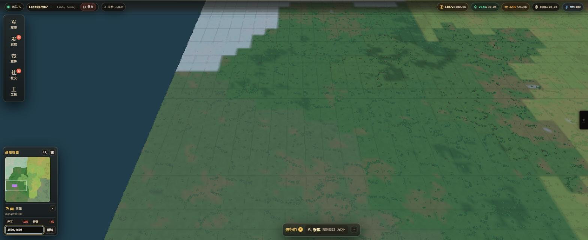
